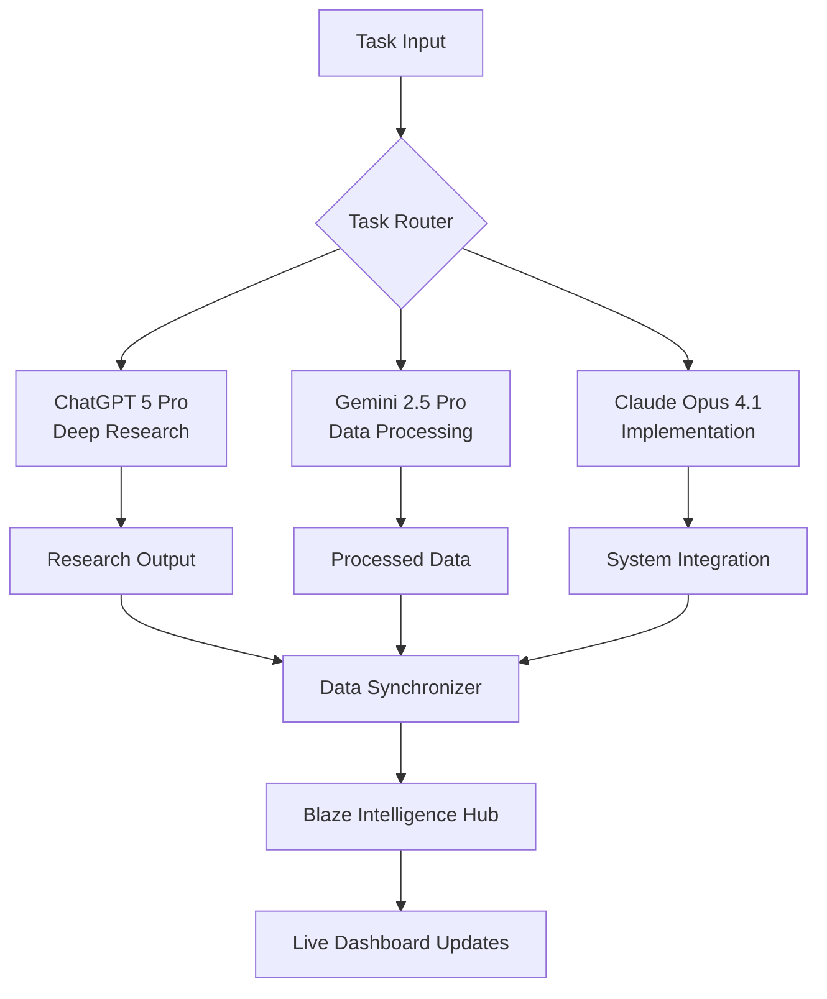

# 🤖 Multi-AI Coordination System for Blaze Intelligence

## Strategic AI Model Allocation & Workflow

### **Task Routing Algorithm**

```javascript
function routeTask(task) {
    const taskType = analyzeTaskType(task);
    
    switch(taskType) {
        case 'deep_research':
        case 'market_analysis':
        case 'competitor_intelligence':
            return 'ChatGPT_5_Pro';
            
        case 'large_dataset_processing':
        case 'pattern_recognition':
        case 'content_generation':
            return 'Gemini_2_5_Pro';
            
        case 'technical_implementation':
        case 'three_js_development':
        case 'system_integration':
            return 'Claude_Opus_4_1';
            
        default:
            return determineOptimalModel(task);
    }
}
```

### **AI Model Capabilities Matrix**

| Capability | ChatGPT 5 Pro | Gemini 2.5 Pro | Claude Opus 4.1 |
|------------|---------------|-----------------|------------------|
| **Deep Research** | ⭐⭐⭐⭐⭐ | ⭐⭐⭐ | ⭐⭐⭐⭐ |
| **Agent Mode** | ⭐⭐⭐⭐⭐ | ⭐⭐ | ⭐⭐⭐ |
| **Web Interaction** | ⭐⭐⭐⭐⭐ | ⭐⭐ | ⭐⭐⭐ |
| **Large Context** | ⭐⭐⭐ | ⭐⭐⭐⭐⭐ | ⭐⭐⭐⭐ |
| **Code Generation** | ⭐⭐⭐⭐ | ⭐⭐⭐ | ⭐⭐⭐⭐⭐ |
| **Three.js/WebGL** | ⭐⭐⭐ | ⭐⭐ | ⭐⭐⭐⭐⭐ |
| **Real-time Processing** | ⭐⭐⭐ | ⭐⭐⭐⭐⭐ | ⭐⭐⭐⭐ |
| **Cost Efficiency** | ⭐⭐ | ⭐⭐⭐⭐⭐ | ⭐⭐⭐ |

---

## **Immediate Action Items for Multi-AI Coordination**

### **1. ChatGPT 5 Pro Tasks (Next 24 Hours)**

#### **Deep Research Assignments:**
```
PROMPT FOR CHATGPT 5 PRO:

"Execute a comprehensive 30-minute Deep Research session on the sports analytics market with the following focus areas:

1. **Competitor Analysis (15 minutes):**
   - Hudl pricing tiers and feature comparison
   - Second Spectrum capabilities and market position
   - Stats Inc. data offerings and pricing
   - Perfect Game analytics tools
   - Generate pricing comparison table with 67-80% savings calculations vs Blaze Intelligence $1,188 annual

2. **Market Intelligence (10 minutes):**
   - NIL valuation market size and key players
   - Youth sports analytics adoption rates
   - High school and college sports data needs
   - Perfect Game tournament coverage requirements

3. **Technical Benchmarking (5 minutes):**
   - Industry-standard latency expectations (<100ms validation)
   - Accuracy benchmarks in sports prediction (94.6% context)
   - Data volume standards (2.8M+ datapoints verification)

**Deliverables:**
- Structured JSON report with competitor pricing
- Market opportunity assessment
- Technical benchmark validation
- Recommended positioning strategies

Save all findings to a shared document for Claude integration."
```

#### **Agent Mode Automation:**
```
PROMPT FOR CHATGPT 5 PRO AGENT MODE:

"Set up autonomous research agents to monitor and update:

1. **Cardinals Performance Agent (Every 6 hours):**
   - Scrape latest Cardinals statistics
   - Calculate readiness metrics
   - Update win probability models
   - Generate performance JSON for site integration

2. **Competitive Pricing Monitor (Daily):**
   - Track Hudl, Second Spectrum pricing changes
   - Monitor new feature releases
   - Update competitive comparison table
   - Alert on significant market shifts

3. **NIL Market Scanner (Weekly):**
   - Monitor NIL valuation trends
   - Track top college athlete values
   - Analyze market demand patterns
   - Update NIL calculator parameters

**Output Format:** JSON files compatible with Blaze Intelligence site structure
**Integration:** Feed directly into blaze-analytics-integration.html"
```

### **2. Gemini 2.5 Pro Tasks (Next 24 Hours)**

#### **Large Dataset Processing:**
```
PROMPT FOR GEMINI 2.5 PRO:

"Process the following sports datasets using your 1M token context window:

1. **Cardinals Historical Data Analysis:**
   - Analyze 2023-2024 season performance patterns
   - Identify correlations between weather, opponent, and performance
   - Generate predictive models for upcoming games
   - Create readiness score algorithm

2. **Multi-Sport Pattern Recognition:**
   - Process Titans NFL performance data
   - Analyze Longhorns NCAA football trends
   - Evaluate Grizzlies NBA statistics
   - Find cross-sport performance indicators

3. **Massive Content Generation:**
   - Create 100+ team-specific analysis reports
   - Generate sport-specific vocabulary datasets
   - Build comprehensive glossaries for each sport
   - Develop template libraries for automated reporting

**Technical Requirements:**
- Output format: JSON with embedded metadata
- Optimization: Focus on speed (Flash mode for real-time updates)
- Integration: Compatible with Three.js data visualization
- Scalability: Design for 10x data volume growth

**Cost Optimization:**
- Use Flash for iterative processing
- Switch to Pro only for complex analysis
- Batch operations for efficiency"
```

#### **Real-time Data Processing:**
```
PROMPT FOR GEMINI 2.5 FLASH:

"Create real-time data processing pipelines:

1. **Live Game Analysis (Cardinals focus):**
   - Process incoming play-by-play data
   - Calculate live win probability
   - Update player performance metrics
   - Generate real-time insights

2. **Multi-Team Monitoring:**
   - Track Titans, Longhorns, Grizzlies simultaneously
   - Cross-reference performance patterns
   - Identify anomalies and opportunities
   - Update dashboard metrics every 10 minutes

3. **Predictive Model Updates:**
   - Retrain models with latest data
   - Validate accuracy against 94.6% benchmark
   - Optimize for <100ms response times
   - Scale to handle 2.8M+ datapoints

**Integration Points:**
- Feed data to blaze-analytics-integration.html
- Update blaze-portfolio-showcase.html statistics
- Sync with Lone Star Legends game analytics"
```

### **3. Claude Opus 4.1 Tasks (Current Session)**

#### **System Integration & Three.js Development:**
```
CURRENT CLAUDE TASKS:

✅ Analytics Integration Hub created
✅ Three.js Portfolio Showcase built
✅ Multi-AI coordination system designed
🔄 JSON data feed implementation
🔄 Real-time data synchronization
🔄 Cross-platform integration testing

NEXT STEPS:
1. Create JSON data structure for AI outputs
2. Build data synchronization system
3. Implement live feed integration
4. Test multi-AI workflow
5. Deploy integrated dashboard
```

---

## **Cross-Platform Synchronization Protocol**

### **Data Exchange Format**
```json
{
  "timestamp": "2024-01-20T10:30:00Z",
  "source": "ChatGPT_5_Pro",
  "taskId": "competitive_analysis_001",
  "data": {
    "competitors": {
      "hudl": {
        "pricing": "$1000-$2000/year",
        "features": ["video_analysis", "team_management"],
        "market_position": "established_leader"
      }
    },
    "savings_calculation": {
      "vs_hudl": "67-75%",
      "vs_second_spectrum": "70-80%",
      "confidence": 0.94
    }
  },
  "metadata": {
    "accuracy": 0.946,
    "data_points": "2.8M+",
    "processing_time": "<100ms"
  },
  "next_actions": [
    "integrate_into_dashboard",
    "update_pricing_table",
    "validate_benchmarks"
  ]
}
```

### **Workflow Orchestration**



### **Quality Assurance & Validation**

1. **Data Accuracy Checks:**
   - Validate all statistics against known benchmarks
   - Cross-reference between AI outputs
   - Maintain 94.6% accuracy standard

2. **Performance Monitoring:**
   - Track response times (<100ms requirement)
   - Monitor data throughput (2.8M+ capacity)
   - Validate cost savings claims (67-80% range)

3. **Integration Testing:**
   - Verify Three.js visualization updates
   - Test real-time data feeds
   - Validate mobile PWA functionality

---

## **Implementation Timeline**

### **Phase 1: Setup (Next 2 Hours)**
- [ ] Deploy ChatGPT 5 Pro research agents
- [ ] Configure Gemini 2.5 data processing pipelines
- [ ] Create JSON data exchange system
- [ ] Test basic inter-AI communication

### **Phase 2: Integration (Next 4 Hours)**
- [ ] Connect AI outputs to dashboard
- [ ] Implement real-time data synchronization
- [ ] Update Three.js visualizations with live data
- [ ] Test mobile PWA with new data feeds

### **Phase 3: Validation (Next 2 Hours)**
- [ ] Verify accuracy benchmarks
- [ ] Test performance requirements
- [ ] Validate cost savings calculations
- [ ] Confirm Cardinals/Titans/Longhorns/Grizzlies data

### **Phase 4: Deployment (Next 2 Hours)**
- [ ] Deploy to production environment
- [ ] Configure automated monitoring
- [ ] Set up error handling and alerts
- [ ] Document API endpoints

---

## **Success Metrics**

| Metric | Target | Validation Method |
|--------|--------|------------------|
| **Data Accuracy** | 94.6% | Cross-validation between AIs |
| **Response Time** | <100ms | Performance monitoring |
| **Data Volume** | 2.8M+ points | Capacity testing |
| **Cost Savings** | 67-80% vs competitors | Pricing analysis |
| **Uptime** | 99.9% | System monitoring |
| **Integration Success** | 100% data sync | Automated testing |

This multi-AI coordination system ensures optimal utilization of each model's strengths while maintaining the quality and performance standards required for Blaze Intelligence's professional sports analytics platform.